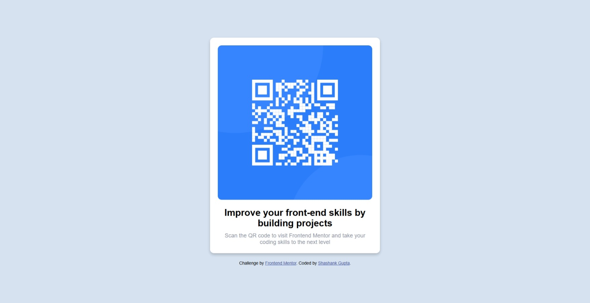

# Frontend Mentor - QR code component solution

This is a solution to the [QR code component challenge on Frontend Mentor](https://www.frontendmentor.io/challenges/qr-code-component-iux_sIO_H). Frontend Mentor challenges help you improve your coding skills by building realistic projects.

## Table of contents

- [Overview](#overview)
  - [Screenshot](#screenshot)
  - [Links](#links)
- [My process](#my-process)
  - [Built with](#built-with)
  - [What I learned](#what-i-learned)
  - [Continued development](#continued-development)
  - [Useful resources](#useful-resources)
- [Author](#author)
- [Acknowledgments](#acknowledgments)

## Overview

### Screenshot



### Links

- Solution URL: [https://github.com/Shashank23codes/qr-code-component](https://github.com/Shashank23codes/qr-code-component)
- Live Site URL: [https://shashank23codes.github.io/qr-code-component](https://shashank23codes.github.io/qr-code-component)

## My process

### Built with

- Semantic HTML5 markup
- CSS custom properties
- Flexbox
- Mobile-first workflow

### What I learned

I learned how to use Flexbox to center elements both vertically and horizontally. Here's an example of the CSS I used:

```css
.container {
  display: flex;
  justify-content: center;
  align-items: center;
  flex-direction: column;
  background-color: #fff;
  border-radius: 10px;
  box-shadow: 0 4px 8px rgba(0, 0, 0, 0.2);
  padding: 20px;
  width: 90%;
  max-width: 400px;
  text-align: center;
}
```

### Continued development

Use this section to outline areas that you want to continue focusing on in future projects. These could be concepts you're still not completely comfortable with or techniques you found useful that you want to refine and perfect.

**Note: Delete this note and the content within this section and replace with your own plans for continued development.**

### Useful resources

- [CSS Tricks](https://css-tricks.com/snippets/css/a-guide-to-flexbox/) - This guide helped me understand Flexbox better.
- [MDN Web Docs ](https://developer.mozilla.org/) - My go-to resource for HTML and CSS documentation.

**Note: Delete this note and replace the list above with resources that helped you during the challenge. These could come in handy for anyone viewing your solution or for yourself when you look back on this project in the future.**

## Author

- Website - [Shashank Gupta](https://www.your-site.com)
- Frontend Mentor - [@Shashank23codes](https://www.frontendmentor.io/profile/Shashank23codes)
- Linkdin - [Shashank Gupta](https://www.linkedin.com/in/shashank-gupta-238a96209)

**Note: Delete this note and add/remove/edit lines above based on what links you'd like to share.**

## Acknowledgments

This is where you can give a hat tip to anyone who helped you out on this project. Perhaps you worked in a team or got some inspiration from someone else's solution. This is the perfect place to give them some credit.

**Note: Delete this note and edit this section's content as necessary. If you completed this challenge by yourself, feel free to delete this section entirely.**
